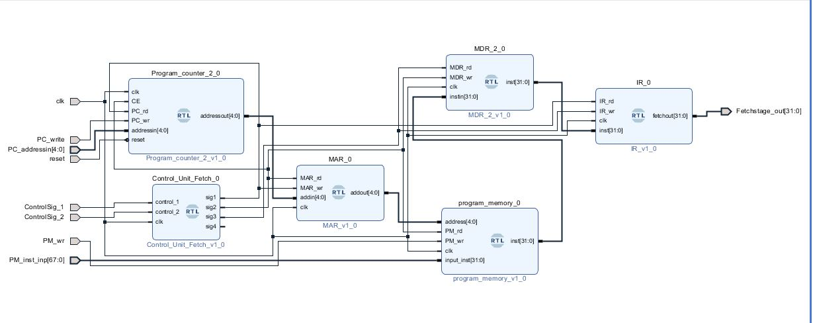

# 32-bit-Pipelined-Processor

Project Under Development

# Fetch Stage #
The Fetch stage designed by me takes 3 cycles to fetch the inctruction from the program memory and output the instruction from Instruction Register to Decode Stage.
Fetch Stage Block Design:-

The process of the fetch stage is as follows-
1. Program Counter Address => Memory Address Register
2. Memory Address Register Address => Program Memory
3. Program counter address => program counter address + 1
4. Program memory instruction @ MAR address => Memory Data Register
5. Memory Data Register => Instruction Register
6. Instruction Register => Decode stage

Fetch Stage Simulation using System Verilog:-

